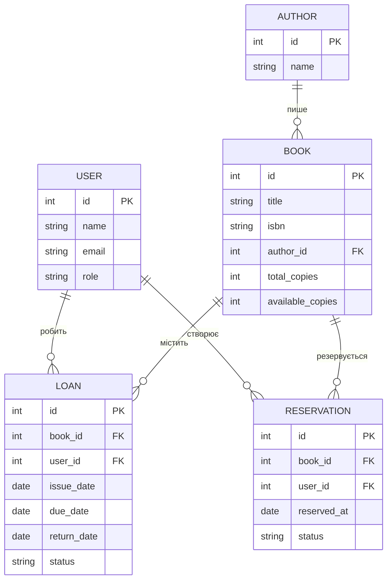

# Розділ 7. Модель даних

## 7.1 Основні сутності

- **Книга (Book)**
  - id, назва, автор, ISBN, рік, кількість екземплярів, доступні копії.
- **Автор (Author)**
  - id, ім'я, прізвище, біографія.
- **Користувач (User)**
  - id, ім'я, прізвище, email, роль (читач / бібліотекар), статус.
- **Позика (Loan)**
  - id, book_id, user_id, дата_видачі, дата_повернення, статус.
- **Бронювання (Reservation)**
  - id, book_id, user_id, дата_бронювання, статус.

## 7.2 Відносини між сутностями

- Один **автор** може мати багато **книг** (1:N).
- Одна **книга** може братися багатьма **користувачами** через записи позик (1:N).
- Один **користувач** може мати кілька записів позик та бронювань (1:N).

## 7.3 Приблизна ER-діаграма (Mermaid)

